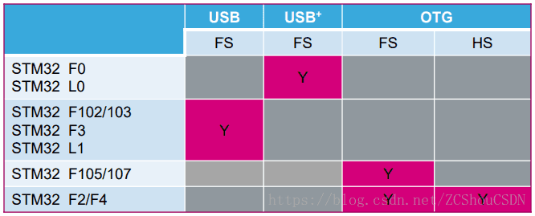
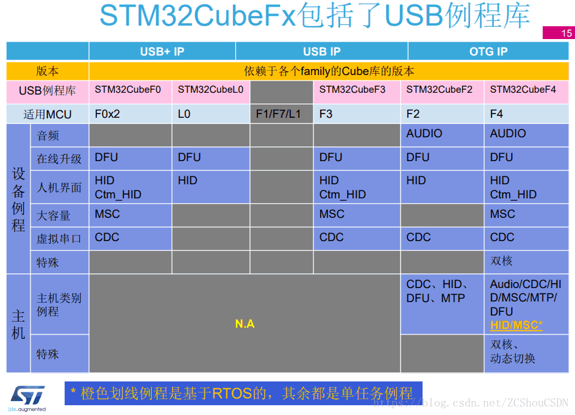

# 模块分类  
在STM32众多系列的MCU中，USB模块并不是相同的，官方称呼为USB IP不同。总的来说可以分为两大类：**USB IP**、**OTG IP**。这两种IP又可以进一步细分，如下图：  
  

# USB驱动程序  

## 标准外设库版（官方培训文档称为Legacy library）  

	针对不同的芯片有不同的独立版本驱动（主要是USB IP有区别）  

**STSW-STM32046**:主要是针对STM32F105/7,STM32F2 and STM32F4 USB on-the-go Host and device library,对应的说明文档为UM1021.  
* 下载地址为https://www.st.com/content/st_com/en/products/embedded-software/mcus-embedded-software/stm32-embedded-software/stm32-standard-peripheral-library-expansion/stsw-stm32046.html  

	实现的设备例程：AUDIO,DFU,HID,MSC,VCP,Dual Core (FS IP和HS IP同时工作，分别实现MSC和HID设备)  
	实现的主机例程：MSC,HID,Dual Core(FS IP和HS IP同时工作，分别实现MSC和HID之际功能)  
	实现双角色例程：DRD（根据插入电缆的不同，分别作MSC主机和MSC设备功能）  
	
	
**STSW-STM32121**：主要是针对STM32F10x,STM32L1xx and STM32F3xx USB full speed device library,对应的说明文档为UM0424.  
* 下载地址为https://www.st.com/content/st_com/en/products/embedded-software/mcus-embedded-software/stm32-embedded-software/stm32-standard-peripheral-library-expansion/stsw-stm32121.html  

	实现的例程（只能是Device）:Audio_Speaker,DFU,MSC,Joystick,Custom_HID,VCP,MSC+HID复合设备。  
	
**STSW-STM32092**:主要是针对STM32F0x2xx USB FS device library,对应的说明为UM1717.  
* 下载地址为https://www.st.com/content/st_com/en/products/embedded-software/mcus-embedded-software/stm32-embedded-software/stm32-standard-peripheral-library-expansion/stsw-stm32092.html  

	这里需要注意，该驱动是针对STM32F0x2xx的，但是可以非常方便的移植到STM32F0xx系列的MCU中。需要根据具体芯片的时钟，修改驱动的usb_conf.h和usb_bsp.c
	实现的例程（只能是Device）:Audio_Speaker,CCID,MSC,Custom_HID,HID,HID_LPM_test,DFU,Virtual_COM_Port,CDC+HID复合设备，MSC+HID复合设备  
	
  

